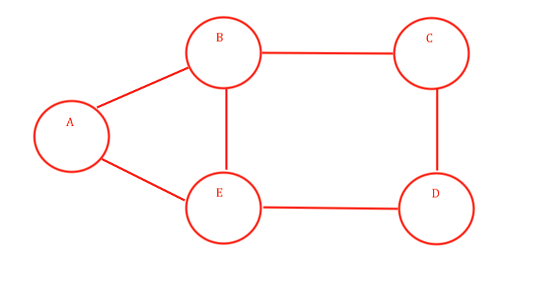
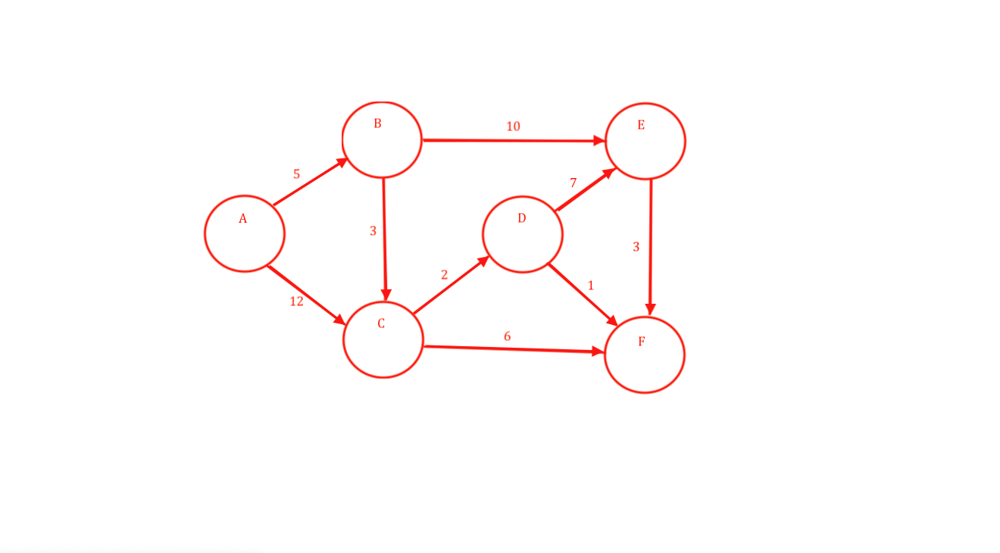
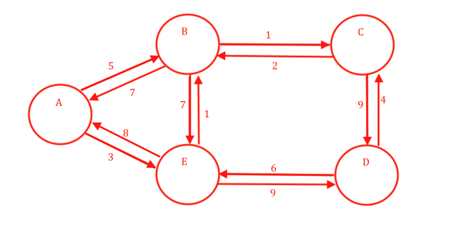
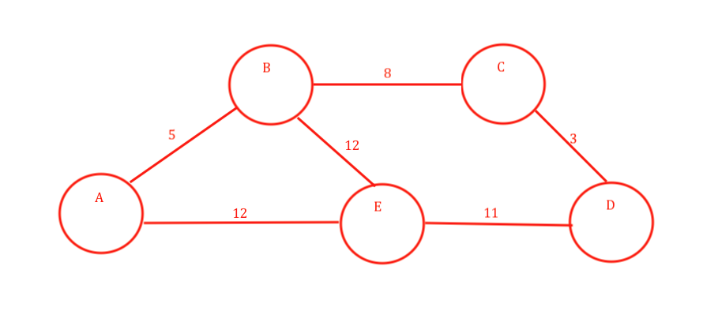

# GraphExample

---

### To Build Code 
* mvn clean package 


---
# UniDirectionalGraph


### graph input data
``` 
value to any graph types will be send in key and list of values 
key is the value of graph nodes and value is the key for adjecent nodes 

    Map<String, List<String>> data = new LinkedHashMap();
    data.put("A", Arrays.asList("B", "E"));
    data.put("B", Arrays.asList("A", "E", "C"));
    data.put("C", Arrays.asList("B", "D"));
    data.put("D", Arrays.asList("C", "E"));
    data.put("E", Arrays.asList("A", "B", "D"));
```

### graph creating
```
 firt check the key exist in the graph collection 
 Map<T, UniDirectionalGraph.Node<T>> graphNode = new LinkedHashMap<>();
 if key exist then return the existing one otherwise create new and add in the graph collection and return it 
 then do the same for the adjecent nodes list and then add them to the main key node adjecent list 
```
### printing the graph 
```
take the first value of the graph collection 
and add into the queue 
then check queue is not empty then 
then take first value from queue then then check for the visited 
if not visited then 
then mark as visited and print that value 
then find the adjecents of that 
check that it must be not be marked as visited and it must not contains in queue 
if it is then add that also in the queue 
and do for other once adjecent list is finished then 
again take from queue 
```

---

# BiDirectionalGraph

### graph input data
``` 
value to any graph types will be send in key and list of values 
key is the value of graph nodes and value is the key for adjecent nodes 

    Map<String, List<String>> data = new LinkedHashMap();
    data.put("A", Arrays.asList("B", "E"));
    data.put("B", Arrays.asList("A", "E", "C"));
    data.put("C", Arrays.asList("B", "D"));
    data.put("D", Arrays.asList("C", "E"));
    data.put("E", Arrays.asList("A", "B", "D"));
```
### graph creating
``` 
 firt check the key exist in the graph collection 
 Map<T, Node<T>> graphNode = new LinkedHashMap<>();
 if key exist then return the existing one otherwise create new and return  
 then iterate on adjecent list and 
 then do the same for the adjecent nodes list and then add them to the main key node adjecent list
 for every adjecent node add the reference of main node to it and add the reference of adjcent node to the main node 
 then save the main node to the graph collection 
```

### printing the graph
```
take the first value of the graph collection 
and add into the queue 
then check queue is not empty then 
then take first value from queue then then check for the visited 
if not visited then 
then mark as visited and print that value 
then find the adjecents of that 
check that it must be not be marked as visited and it must not contains in queue 
if it is then add that also in the queue 
and do for other once adjecent list is finished then 
again take from queue 
```

---
# WeightedGraph

```
every node is having value then weight of node and the list of adjecent nodes  
```
### graph input data 
``` 
    Map<String, HashMap<String, Integer>> wightedData = new LinkedHashMap();
        wightedData.put("A", new HashMap<String, Integer>() {
            {
                put("B", 5);
                put("E", 3);
            }
        });
        wightedData.put("B", new HashMap<String, Integer>() {
            {
                put("A", 7);
                put("C", 1);
                put("E", 8);
            }
        });
        wightedData.put("C", new HashMap<String, Integer>() {
            {
                put("B", 2);
                put("D", 9);
            }
        });
        wightedData.put("D", new HashMap<String, Integer>() {
            {
                put("C", 4);
                put("E", 6);
            }
        });
        wightedData.put("E", new HashMap<String, Integer>() {
            {
                put("A", 8);
                put("B", 1);
                put("D", 9);
            }
        });
     above is the input for the graph    
```

### graph creating
``` 
firt check the key exist in the graph collection 
 Map<T, WeightedGraph.Node<T>> graphNode = new LinkedHashMap<>();
 if key exist then return the existing one otherwise create new  with node weight and return  
 then iterate on adjecent list and do the above for same and add them to the main node adjecent list 
  then save the main node to the graph collection 
```
### printing the graph
```
take the first value of the graph collection 
and add into the queue 
then check queue is not empty then 
then take first value from queue then then check for the visited 
if not visited then 
then mark as visited and print that value 
then find the adjecents of that 
check that it must be not be marked as visited and it must not contains in queue 
if it is then add that also in the queue 
and do for other once adjecent list is finished then 
again take from queue 
```

---
# PathWeightedGraph

```
every node is having value then weight of node and the list of adjecent nodes  
```
### graph input data
``` 
    Map<String, HashMap<String, Integer>> wightedPathData = new LinkedHashMap();
        wightedPathData.put("A", new HashMap<String, Integer>() {
            {
                put("B", 5);
                put("C", 12);
            }
        });
        wightedPathData.put("B", new HashMap<String, Integer>() {
            {
                put("C", 3);
                put("E", 10);
            }
        });
        wightedPathData.put("C", new HashMap<String, Integer>() {
            {
                put("D", 2);
                put("F", 6);
            }
        });
        wightedPathData.put("D", new HashMap<String, Integer>() {
            {
                put("E", 7);
                put("F", 1);
            }
        });
        wightedPathData.put("E", new HashMap<String, Integer>() {
            {
                put("F", 3);
            }
        });
        wightedPathData.put("F", new HashMap<String, Integer>() {
        });
     above is the input for the graph    
```
### graph creating
``` 
firt check the key exist in the graph collection 
 Map<T, PathWeightedGraph.Node<T>> graphNode = new LinkedHashMap<>();
 if key exist then return the existing one otherwise create new  with node weight and return  
 add the order for every node which is created new and assigned back to that node 
 then iterate on adjecent list and do the above for same and add them to the main node adjecent list 
  then save the main node to the graph collection 
```

### printing the graph
```
take the first value of the graph collection 
and add into the queue 
then check queue is not empty then 
then take first value from queue then then check for the visited 
if not visited then 
then mark as visited and print that value 
then find the adjecents of that 
check that it must be not be marked as visited and it must not contains in queue 
if it is then add that also in the queue 
and do for other once adjecent list is finished then 
again take from queue 
```

### calculating shorted path 
``` 
take input of start and end node in the graph 
set the shorted  path value to 0 
and get the order of the node for start and end 
then add into the queue 
then loop till the queue is empty 
then pull the data from queue and get the adjecent list 
get the shortpath  path of the adjecent add with the node we pulled out from queue and 
check if the current computed short path is shorter then the 
current adjecent node short path and assigned based on the check 
and finaly check that node is with in the order boundry of start and end node 
then push to the queue and repeate it agian 

```

### calculating longest path
``` 

take input of start and end node in the graph 
set the  longest path value to 0 
and get the order of the node for start and end 
then add into the queue 
then loop till the queue is empty 
then pull the data from queue and get the adjecent list 
get the  long path of the adjecent add with the node we pulled out from queue and 
check if the current computed long paht  path is greater  then the 
current adjecent node long path and short path and assigned based on the check 
and finaly check that node is with in the order boundry of start and end node 
then push to the queue and repeate it agian 
```

### calculating path between nodes 
```
 
```
---

# CyclicPathGraph


### graph input data
```
 Map<String, HashMap<String, Integer>> cyclicPathGraph = new LinkedHashMap();
        cyclicPathGraph.put("A", new HashMap<String, Integer>() {
            {
                put("B", 5);
                put("E", 12);
            }
        });
        cyclicPathGraph.put("B", new HashMap<String, Integer>() {
            {
                put("A", 5);
                put("C", 8);
                put("E", 12);
            }
        });
        cyclicPathGraph.put("C", new HashMap<String, Integer>() {
            {
                put("B", 8);
                put("D", 3);
            }
        });
        cyclicPathGraph.put("D", new HashMap<String, Integer>() {
            {
                put("C", 3);
                put("E", 11);
            }
        });
        cyclicPathGraph.put("E", new HashMap<String, Integer>() {
            {
                put("A", 12);
                put("B", 12);
                put("D", 11);
            }
        }); 
```
### graph creating
``` 
```

### printing the graph
```

```

---