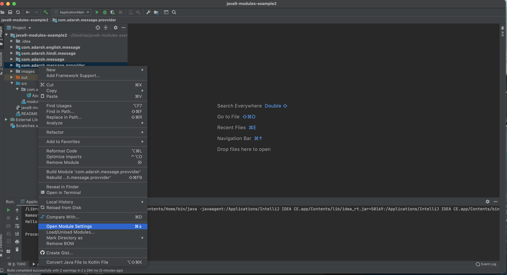
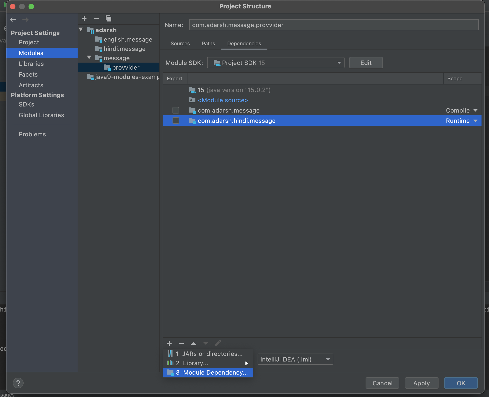
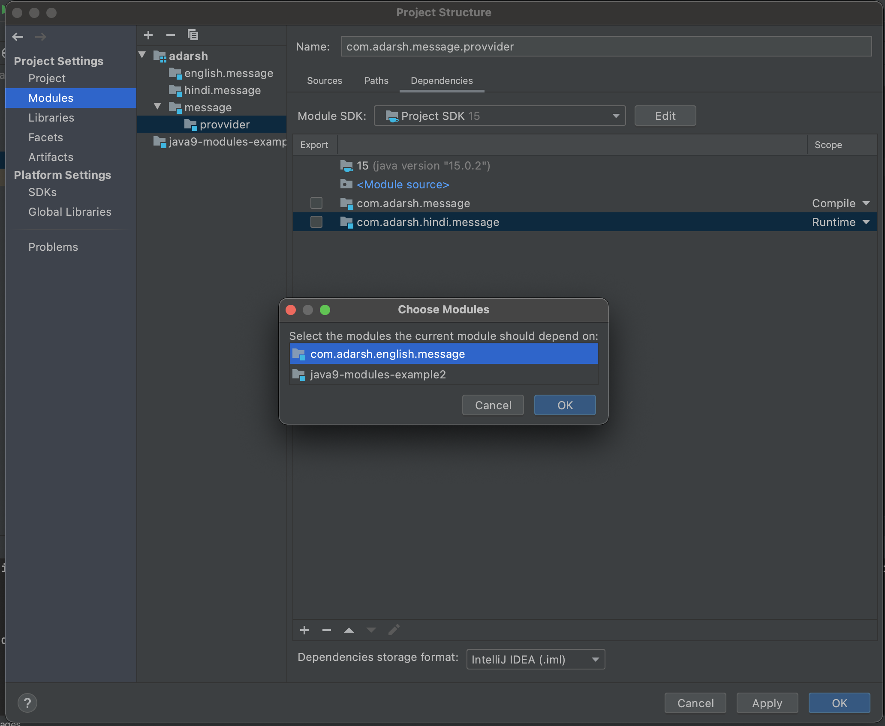
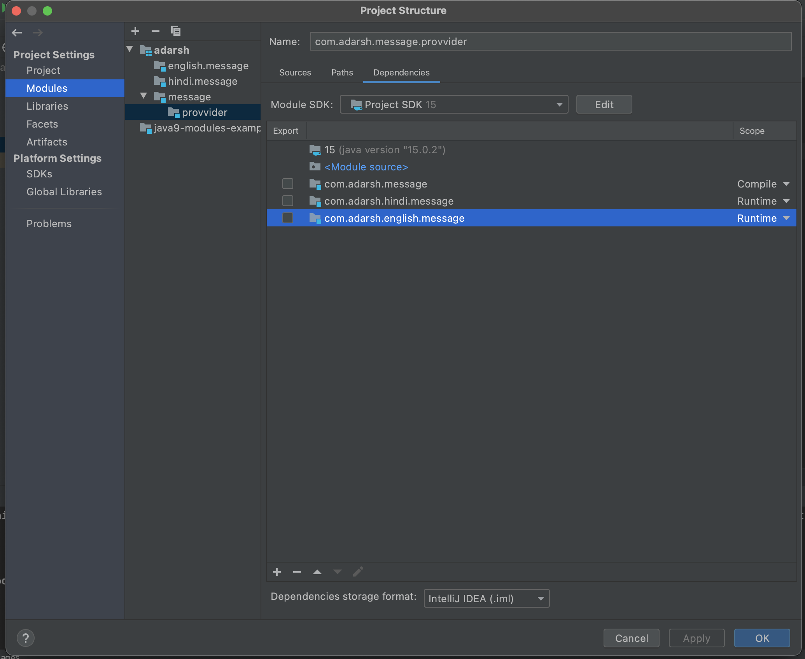

# java9-modules-dependency 
---

* To enable select -> com.adarsh.message.provider module -> Open Module settings 

* select the provider module in the modules tab then click on the '+' button ->Module dependency 

* select the message implementation module which we want to include in the build for the provider module

* change the scope to the runtime for execution 
