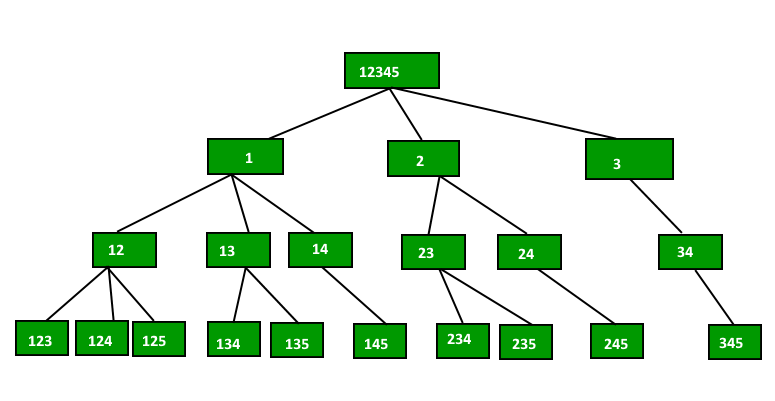

# array number combinations 

--- 

* create a empty array of size combination 
* get the length of the provided array 
* pass the origin data array, combination temp array, 
  index to iteration on combination temp array, start index
  for iteration on original data array and end index of original data array  
* check first the combination temp array index is equal to the combination length 
* if true then print the combination temp array
* iterate on the array keep first from start index to the end index pass in method args.
  and also check (endIndex of original array - loopIndex +1 ) greater than equal to the 
  (combination length - combination array index) must be  
  this will ensure if the length of combination temp array is less than combination length 
  and loopIndex is not reached to the endIndex of the original data array so we can still fill 
  some numbers ot the combination temp array. 
* call the same method in recursion passing the origin data array, combination temp array 
  increment the combination temp array, pass the loopIndex+1 as the start for iteration 
  endIndex and the combination length. 
* repeate this unless we get the recursion complete. 
