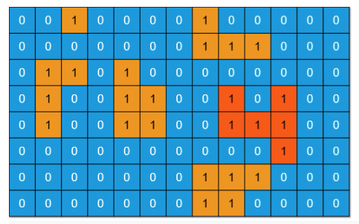

# IsLandArea Calculations



## output 
```    
Area size 1 Positions [0:2]
Area size 4 Positions [0:7, 1:7, 1:8, 1:9]
Area size 4 Positions [2:1, 2:2, 3:1, 4:1]
Area size 5 Positions [2:4, 3:4, 3:5, 4:4, 4:5]
Area size 6 Positions [3:10, 3:8, 4:10, 4:8, 4:9, 5:10]
Area size 5 Positions [6:7, 6:8, 6:9, 7:7, 7:8]
```