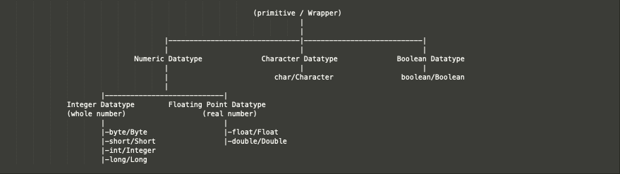

# Data Type

---


```

                                                            (primitive / Wrapper)
																	   |
                                                                       |
									   |-------------------------------|----------------------------|
									   |							   |                            |
								Numeric Datatype              Character Datatype              Boolean Datatype
									   |                               |							|
									   |                         char/Character                boolean/Boolean
									   |
						|----------------------------|
				Integer Datatype        Floating Point Datatype		
				(whole number)                  (real number)
						|							 |
			            |-byte/Byte					 |-float/Float
						|-short/Short                |-double/Double
						|-int/Integer         
						|-long/Long

```