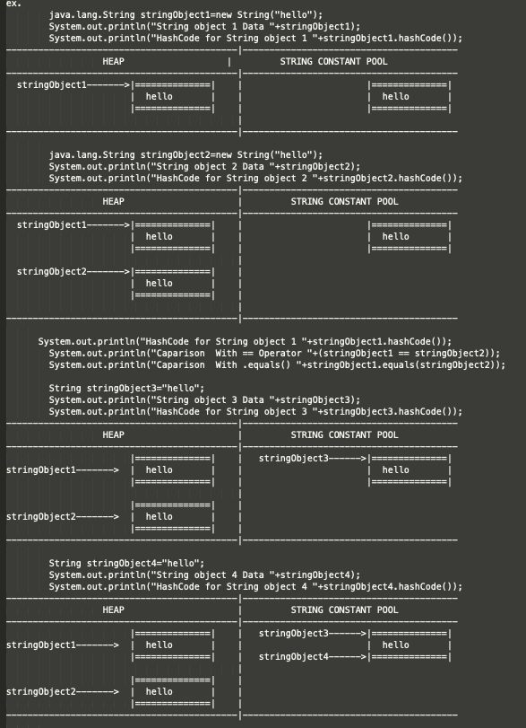
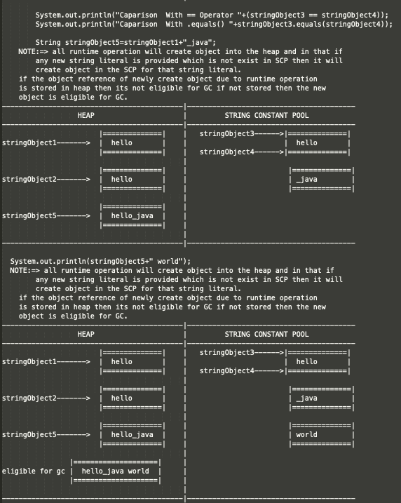
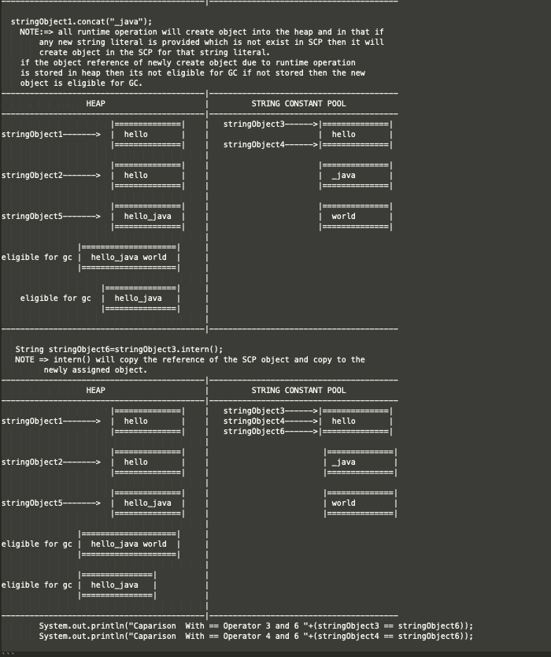

```
1.String class is immutable class	
2.String class is final Class
3.Initial size of the String is zero or based on the initial 
  data provided to the string in the constructor.
4.Implements Serializable,comparable,CharSequence
5.toString() is for Content printing
6.equals() is for Content Comparison
7.hashCode() is for content base hash code generation.
8.String isn't thread safe
9.Intro JDK1.0
10.String class have String Constant pool SCP.
11.when ever we are created any string object using new keyword then and provided
   string literal in the double quotes then 2 object is created one on the heap due 
   to new keyword and another one on the SCP due to double quotes.
12.All the String Literal provided in double quotes created a object in the SCP.
13.All the run time operation perform on the string create a new object in the heap.
14.At any point of time no duplicate string object will be their at SCP if the object is 
  available then it use existing object otherwise new object is created and pointed.
15.Inside heap object having duplicate data can exist at any point of the time.
16.GC doesn't have access in the SCP so unused object will not be destroyed.
```

```
ex. 
        java.lang.String stringObject1=new String("hello");
        System.out.println("String object 1 Data "+stringObject1);
        System.out.println("HashCode for String object 1 "+stringObject1.hashCode());
-------------------------------------------|----------------------------------------
	                HEAP                   |         STRING CONSTANT POOL
-------------------------------------------|----------------------------------------
  stringObject1------->|==============|    |                       |==============| 
	                     |	hello       |    |                       |	hello       |                              
	                     |==============|    |                       |==============| 
								                           |
-------------------------------------------|----------------------------------------

        java.lang.String stringObject2=new String("hello");
        System.out.println("String object 2 Data "+stringObject2);
        System.out.println("HashCode for String object 2 "+stringObject2.hashCode());
-------------------------------------------|----------------------------------------
	                HEAP                     |         STRING CONSTANT POOL
-------------------------------------------|----------------------------------------
  stringObject1------->|==============|    |                       |==============| 
	                     |	hello       |    |                       |	hello       |                              
	                     |==============|    |                       |==============| 
                                           |
  stringObject2------->|==============|    |                      
	                     |	hello       |    |                                                 
	                     |==============|    |                      
								                           |
-------------------------------------------|----------------------------------------
		
	    System.out.println("HashCode for String object 1 "+stringObject1.hashCode());
        System.out.println("Caparison  With == Operator "+(stringObject1 == stringObject2));
        System.out.println("Caparison  With .equals() "+stringObject1.equals(stringObject2));

        String stringObject3="hello";
        System.out.println("String object 3 Data "+stringObject3);
        System.out.println("HashCode for String object 3 "+stringObject3.hashCode());		
-------------------------------------------|----------------------------------------
	                HEAP                     |         STRING CONSTANT POOL
-------------------------------------------|----------------------------------------
                       |==============|    |   stringObject3------>|==============| 
stringObject1------->  |	hello       |    |                       |	hello       |                              
	                     |==============|    |                       |==============| 
                                           |
                       |==============|    |                      
stringObject2------->  |	hello       |    |                                                 
	                     |==============|    |                      
-------------------------------------------|----------------------------------------		

        String stringObject4="hello";
        System.out.println("String object 4 Data "+stringObject4);
        System.out.println("HashCode for String object 4 "+stringObject4.hashCode());
-------------------------------------------|----------------------------------------
	                HEAP                     |         STRING CONSTANT POOL
-------------------------------------------|----------------------------------------
                       |==============|    |   stringObject3------>|==============| 
stringObject1------->  |	hello       |    |                       |	hello       |                              
	                     |==============|    |   stringObject4------>|==============| 
                                           |
                       |==============|    |                      
stringObject2------->  |	hello       |    |                                                 
	                     |==============|    |                      
-------------------------------------------|----------------------------------------		

        System.out.println("Caparison  With == Operator "+(stringObject3 == stringObject4));
        System.out.println("Caparison  With .equals() "+stringObject3.equals(stringObject4));

        String stringObject5=stringObject1+"_java";
		NOTE:=> all runtime operation will create object into the heap and in that if 
        any new string literal is provided which is not exist in SCP then it will 
        create object in the SCP for that string literal.
		if the object reference of newly create object due to runtime operation
		is stored in heap then its not eligible for GC if not stored then the new 
		object is eligible for GC.
-------------------------------------------|----------------------------------------
	                HEAP                     |         STRING CONSTANT POOL
-------------------------------------------|----------------------------------------
                       |==============|    |   stringObject3------>|==============| 
stringObject1------->  |	hello       |    |                       |	hello       |                              
	                     |==============|    |   stringObject4------>|==============| 
                                           |
                       |==============|    |                        |==============|
stringObject2------->  |	hello       |    |                        |	_java        |                                
	                     |==============|    |                        |==============| 
					                                 |
					             |==============|    |
stringObject5------->  |  hello_java  |    |
                       |==============|    |					   
					                                 |
-------------------------------------------|----------------------------------------	

  System.out.println(stringObject5+" world");   
  NOTE:=> all runtime operation will create object into the heap and in that if 
        any new string literal is provided which is not exist in SCP then it will 
        create object in the SCP for that string literal.
		if the object reference of newly create object due to runtime operation
		is stored in heap then its not eligible for GC if not stored then the new 
		object is eligible for GC.
-------------------------------------------|----------------------------------------
	                HEAP                     |         STRING CONSTANT POOL
-------------------------------------------|----------------------------------------
                       |==============|    |   stringObject3------>|==============| 
stringObject1------->  |	hello       |    |                       |	hello       |                              
	                     |==============|    |   stringObject4------>|==============| 
                                           |
                       |==============|    |                        |==============|
stringObject2------->  |	hello       |    |                        |	_java        |                                
	                     |==============|    |                        |==============| 
					                                 |
					             |==============|    |                        |==============|
stringObject5------->  |  hello_java  |    |                        |	world        |    
                       |==============|    |			          		    |==============| 
					                                 |
   		          |====================|     |
eligible for gc |  hello_java world  |     |
                |====================|     |	
					                                 |
-------------------------------------------|----------------------------------------	

  stringObject1.concat("_java");
    NOTE:=> all runtime operation will create object into the heap and in that if 
        any new string literal is provided which is not exist in SCP then it will 
        create object in the SCP for that string literal.
		if the object reference of newly create object due to runtime operation
		is stored in heap then its not eligible for GC if not stored then the new 
		object is eligible for GC.		
-------------------------------------------|----------------------------------------
	                HEAP                     |         STRING CONSTANT POOL
-------------------------------------------|----------------------------------------
                       |==============|    |   stringObject3------>|==============| 
stringObject1------->  |	hello       |    |                       |	hello       |                              
	                     |==============|    |   stringObject4------>|==============| 
                                           |
                       |==============|    |                       |==============|
stringObject2------->  |	hello       |    |                       |	_java       |                                
	                     |==============|    |                       |==============| 
					                                 |
					             |==============|    |                       |==============|
stringObject5------->  |  hello_java  |    |                       |	world       |    
                       |==============|    |				          	   |==============| 
					                                 |
   		          |====================|     |
eligible for gc |  hello_java world  |     |
                |====================|     |
				                                   |
   		               |===============|     |
    eligible for gc  |  hello_java   |     |
                     |===============|     |				
					                                 |
-------------------------------------------|----------------------------------------	

   String stringObject6=stringObject3.intern();
   NOTE => intern() will copy the reference of the SCP object and copy to the 
         newly assigned object.
-------------------------------------------|----------------------------------------
	                HEAP                     |         STRING CONSTANT POOL
-------------------------------------------|----------------------------------------
                       |==============|    |   stringObject3------>|==============| 
stringObject1------->  |	hello       |    |   stringObject4------>|	hello       |                              
	                     |==============|    |   stringObject6------>|==============| 
                                           |
                       |==============|    |                        |==============|
stringObject2------->  |	hello       |    |                        |	_java        |                                
	                     |==============|    |                        |==============| 
					                                 |
					             |==============|    |                        |==============|
stringObject5------->  |  hello_java  |    |                        |	world        |    
                       |==============|    |				          	    |==============| 
					                                 |
   		          |====================|     |
eligible for gc |  hello_java world  |     |
                |====================|     |
				                                   |
   		          |===============|          |
eligible for gc |  hello_java   |          |
                |===============|          |				
					                                 |
-------------------------------------------|----------------------------------------	
        System.out.println("Caparison  With == Operator 3 and 6 "+(stringObject3 == stringObject6));
        System.out.println("Caparison  With == Operator 4 and 6 "+(stringObject4 == stringObject6));

```

```
public final class java.lang.String 
		implements java.io.Serializable, java.lang.Comparable<java.lang.String>, java.lang.CharSequence {
		
  public static final java.util.Comparator<java.lang.String> CASE_INSENSITIVE_ORDER;
  
  public java.lang.String();
  public java.lang.String(java.lang.String);
  public java.lang.String(char[]);
  public java.lang.String(char[], int, int);
  public java.lang.String(int[], int, int);
  public java.lang.String(byte[], int, int, int);
  public java.lang.String(byte[], int);
  public java.lang.String(byte[], int, int, java.lang.String) throws java.io.UnsupportedEncodingException;
  public java.lang.String(byte[], int, int, java.nio.charset.Charset);
  public java.lang.String(byte[], java.lang.String) throws java.io.UnsupportedEncodingException;
  public java.lang.String(byte[], java.nio.charset.Charset);
  public java.lang.String(byte[], int, int);
  public java.lang.String(byte[]);
  public java.lang.String(java.lang.StringBuffer);
  public java.lang.String(java.lang.StringBuilder);  
  
  /*the length of the sequence of characters represented by this String object*/
  public int length();
  
  /*Return true only if length is zero otherwise false*/
  public boolean isEmpty();
  
  /*Return the char at the index otherwise IndexOutOfBoundsException*/
  public char charAt(int);
  
  /*Return the char code at the index otherwise IndexOutOfBoundsException */
  public int codePointAt(int);
  
  /* */
  public int codePointBefore(int);
  
  public int codePointCount(int, int);
  public int offsetByCodePoints(int, int);
  
  public void getChars(int, int, char[], int);
  
  public void getBytes(int, int, byte[], int);
  public byte[] getBytes(java.lang.String) throws java.io.UnsupportedEncodingException;
  public byte[] getBytes(java.nio.charset.Charset);
  public byte[] getBytes();
  
  public boolean equals(java.lang.Object);
  
  public boolean contentEquals(java.lang.StringBuffer);
  public boolean contentEquals(java.lang.CharSequence);
  
  public boolean equalsIgnoreCase(java.lang.String);
  
  public int compareTo(java.lang.String);
  public int compareToIgnoreCase(java.lang.String);
  
  public boolean regionMatches(int, java.lang.String, int, int);
  public boolean regionMatches(boolean, int, java.lang.String, int, int);
  
  public boolean startsWith(java.lang.String, int);
  public boolean startsWith(java.lang.String);
  public boolean endsWith(java.lang.String);
  
  public int hashCode();
  
  public int indexOf(int);
  public int indexOf(int, int);
  public int lastIndexOf(int);
  public int lastIndexOf(int, int);
  public int indexOf(java.lang.String);
  public int indexOf(java.lang.String, int);
  static int indexOf(char[], int, int, char[], int, int, int);
  
  public int lastIndexOf(java.lang.String);
  public int lastIndexOf(java.lang.String, int);
  static int lastIndexOf(char[], int, int, char[], int, int, int);
  
  public java.lang.String substring(int);
  public java.lang.String substring(int, int);
  
  public java.lang.CharSequence subSequence(int, int);
  
  public java.lang.String concat(java.lang.String);
  
  public java.lang.String replace(char, char);
  
  public boolean matches(java.lang.String);
  
  public boolean contains(java.lang.CharSequence);
  
  public java.lang.String replaceFirst(java.lang.String, java.lang.String);
  public java.lang.String replaceAll(java.lang.String, java.lang.String);
  public java.lang.String replace(java.lang.CharSequence, java.lang.CharSequence);
  
  public java.lang.String[] split(java.lang.String, int);
  public java.lang.String[] split(java.lang.String);
  
  public java.lang.String toLowerCase(java.util.Locale);
  public java.lang.String toLowerCase();
  
  public java.lang.String toUpperCase(java.util.Locale);
  public java.lang.String toUpperCase();
  
  public java.lang.String trim();
  
  public java.lang.String toString();
  
  public char[] toCharArray();
  
  public static java.lang.String format(java.lang.String, java.lang.Object...);
  public static java.lang.String format(java.util.Locale, java.lang.String, java.lang.Object...);
  
  public static java.lang.String valueOf(java.lang.Object);
  public static java.lang.String valueOf(char[]);
  public static java.lang.String valueOf(char[], int, int);
  public static java.lang.String copyValueOf(char[], int, int);
  public static java.lang.String copyValueOf(char[]);
  
  /*Converting primitive datatype into String */
  public static java.lang.String valueOf(boolean);
  public static java.lang.String valueOf(char);
  public static java.lang.String valueOf(int);
  public static java.lang.String valueOf(long);
  public static java.lang.String valueOf(float);
  public static java.lang.String valueOf(double);
  
  /*method for getting the reference from String Constant pool */
  public native java.lang.String intern();
  
  /* Comparable interface method */
  public int compareTo(java.lang.Object);  
}
```

---
```
1.StringBuffer class is mutable class
2.StringBuffer is having buffer support.
3.initial capacity of buffer 16 characters or 
  based on the data supplied to StringBuffer.
4.formula for new capacity up-to 
  jdk 1.6   newCapacity = (currentCapacity + 1) * 2
  jdk 1.7    newCapacity = (currentCapacity * 2) + 2
5.StringBuffer class is final Class
6.Implements Serializable,CharSequence
7.toString() is for Content printing
8.equals() is for Reference Comparison
9.hashCode() is not based on content.
10.StringBuffer is thread safe
11.Intro JDK1.0
```

---
```
public final class java.lang.StringBuffer extends java.lang.AbstractStringBuilder
			 implements java.io.Serializable,java.lang.CharSequence {
  
  public java.lang.StringBuffer();
  public java.lang.StringBuffer(int);
  public java.lang.StringBuffer(java.lang.String);
  public java.lang.StringBuffer(java.lang.CharSequence);
  
  public synchronized int length();
  public synchronized int capacity();
  public synchronized void ensureCapacity(int);
  public synchronized void trimToSize();
  public synchronized void setLength(int);
  public synchronized char charAt(int);
  public synchronized int codePointAt(int);
  public synchronized int codePointBefore(int);
  public synchronized int codePointCount(int, int);
  public synchronized int offsetByCodePoints(int, int);
  public synchronized void getChars(int, int, char[], int);
  public synchronized void setCharAt(int, char);
  public synchronized java.lang.StringBuffer append(java.lang.Object);
  public synchronized java.lang.StringBuffer append(java.lang.String);
  public synchronized java.lang.StringBuffer append(java.lang.StringBuffer);
  public java.lang.StringBuffer append(java.lang.CharSequence);
  public synchronized java.lang.StringBuffer append(java.lang.CharSequence, int, int);
  public synchronized java.lang.StringBuffer append(char[]);
  public synchronized java.lang.StringBuffer append(char[], int, int);
  public synchronized java.lang.StringBuffer append(boolean);
  public synchronized java.lang.StringBuffer append(char);
  public synchronized java.lang.StringBuffer append(int);
  public synchronized java.lang.StringBuffer appendCodePoint(int);
  public synchronized java.lang.StringBuffer append(long);
  public synchronized java.lang.StringBuffer append(float);
  public synchronized java.lang.StringBuffer append(double);
  public synchronized java.lang.StringBuffer delete(int, int);
  public synchronized java.lang.StringBuffer deleteCharAt(int);
  public synchronized java.lang.StringBuffer replace(int, int, java.lang.String);
  public synchronized java.lang.String substring(int);
  public synchronized java.lang.CharSequence subSequence(int, int);
  public synchronized java.lang.String substring(int, int);
  
  public synchronized java.lang.StringBuffer insert(int, char[], int, int);
  public synchronized java.lang.StringBuffer insert(int, java.lang.Object);
  public synchronized java.lang.StringBuffer insert(int, java.lang.String);
  public synchronized java.lang.StringBuffer insert(int, char[]);  
  public java.lang.StringBuffer insert(int, java.lang.CharSequence);
  public synchronized java.lang.StringBuffer insert(int, java.lang.CharSequence, int, int);
  public java.lang.StringBuffer insert(int, boolean);
  public synchronized java.lang.StringBuffer insert(int, char);
  public java.lang.StringBuffer insert(int, int);
  public java.lang.StringBuffer insert(int, long);
  public java.lang.StringBuffer insert(int, float);
  public java.lang.StringBuffer insert(int, double);
  
  public int indexOf(java.lang.String);
  public synchronized int indexOf(java.lang.String, int);
  public int lastIndexOf(java.lang.String);
  public synchronized int lastIndexOf(java.lang.String, int);
  public synchronized java.lang.StringBuffer reverse();
  public synchronized java.lang.String toString();
  public java.lang.AbstractStringBuilder reverse();
  
  public java.lang.AbstractStringBuilder insert(int, double);
  public java.lang.AbstractStringBuilder insert(int, float);
  public java.lang.AbstractStringBuilder insert(int, long);
  public java.lang.AbstractStringBuilder insert(int, int);
  public java.lang.AbstractStringBuilder insert(int, char);
  public java.lang.AbstractStringBuilder insert(int, boolean);
  
  public java.lang.AbstractStringBuilder insert(int, java.lang.CharSequence, int, int);
  public java.lang.AbstractStringBuilder insert(int, java.lang.CharSequence);
  public java.lang.AbstractStringBuilder insert(int, char[]);
  public java.lang.AbstractStringBuilder insert(int, java.lang.String);
  public java.lang.AbstractStringBuilder insert(int, java.lang.Object);
  public java.lang.AbstractStringBuilder insert(int, char[], int, int);
  public java.lang.AbstractStringBuilder replace(int, int, java.lang.String);
  public java.lang.AbstractStringBuilder deleteCharAt(int);
  public java.lang.AbstractStringBuilder appendCodePoint(int);
  public java.lang.AbstractStringBuilder delete(int, int);
  public java.lang.AbstractStringBuilder append(double);
  public java.lang.AbstractStringBuilder append(float);
  public java.lang.AbstractStringBuilder append(long);
  public java.lang.AbstractStringBuilder append(int);
  public java.lang.AbstractStringBuilder append(char);
  public java.lang.AbstractStringBuilder append(boolean);
  public java.lang.AbstractStringBuilder append(char[], int, int);
  public java.lang.AbstractStringBuilder append(char[]);
  public java.lang.AbstractStringBuilder append(java.lang.CharSequence, int, int);
  public java.lang.AbstractStringBuilder append(java.lang.CharSequence);
  public java.lang.AbstractStringBuilder append(java.lang.StringBuffer);
  public java.lang.AbstractStringBuilder append(java.lang.String);
  public java.lang.AbstractStringBuilder append(java.lang.Object);
  public java.lang.Appendable append(char) throws java.io.IOException;
  public java.lang.Appendable append(java.lang.CharSequence, int, int) throws java.io.IOException;
  public java.lang.Appendable append(java.lang.CharSequence) throws java.io.IOException;
  
}
```
---
```
1.StringBuilder class is mutable class
2.StringBuffer is supported by the Buffer.
3.StringBuilder class is final Class
4.initial capacity of 16 characters and based on the data supplied initial
5.formula for new capacity upto 
   jdk 1.6   newCapacity = (currentCapacity + 1) * 2
   jdk 1.7    newCapacity = (currentCapacity * 2) + 2
6.Implements Serializable,CharSequence
7.toString() is for Content printing
8.equals() is for Reference Comparison
9.hashCode() is not based on content.
10.StringBuilder isn't thread safe
11.Intro JDK1.5
```
---
```
public final class java.lang.StringBuilder extends java.lang.AbstractStringBuilder 
			implements java.io.Serializable,java.lang.CharSequence {
			  
  public java.lang.StringBuilder();
  public java.lang.StringBuilder(int);
  public java.lang.StringBuilder(java.lang.String);  
  public java.lang.StringBuilder(java.lang.CharSequence);
  
  public java.lang.StringBuilder append(java.lang.Object);
  public java.lang.StringBuilder append(java.lang.String);
  public java.lang.StringBuilder append(java.lang.StringBuffer);
  public java.lang.StringBuilder append(java.lang.CharSequence);
  public java.lang.StringBuilder append(java.lang.CharSequence, int, int);
  public java.lang.StringBuilder append(char[]);
  public java.lang.StringBuilder append(char[], int, int);
  public java.lang.StringBuilder append(boolean);
  public java.lang.StringBuilder append(char);
  public java.lang.StringBuilder append(int);
  public java.lang.StringBuilder append(long);
  public java.lang.StringBuilder append(float);
  public java.lang.StringBuilder append(double);
  public java.lang.StringBuilder appendCodePoint(int);
  
  public java.lang.StringBuilder delete(int, int);
  public java.lang.StringBuilder deleteCharAt(int);
  
  public java.lang.StringBuilder replace(int, int, java.lang.String);
  public java.lang.StringBuilder insert(int, char[], int, int);
  public java.lang.StringBuilder insert(int, java.lang.Object);
  public java.lang.StringBuilder insert(int, java.lang.String);
  public java.lang.StringBuilder insert(int, char[]);
  public java.lang.StringBuilder insert(int, java.lang.CharSequence);
  public java.lang.StringBuilder insert(int, java.lang.CharSequence, int, int);
  public java.lang.StringBuilder insert(int, boolean);
  public java.lang.StringBuilder insert(int, char);
  public java.lang.StringBuilder insert(int, int);
  public java.lang.StringBuilder insert(int, long);
  public java.lang.StringBuilder insert(int, float);
  public java.lang.StringBuilder insert(int, double);
  
  public int indexOf(java.lang.String);
  public int indexOf(java.lang.String, int);
  public int lastIndexOf(java.lang.String);
  public int lastIndexOf(java.lang.String, int);
  public java.lang.StringBuilder reverse();
  
  public java.lang.String toString();
  
  public java.lang.AbstractStringBuilder reverse();
  public java.lang.AbstractStringBuilder insert(int, double);
  public java.lang.AbstractStringBuilder insert(int, float);
  public java.lang.AbstractStringBuilder insert(int, long);
  public java.lang.AbstractStringBuilder insert(int, int);
  public java.lang.AbstractStringBuilder insert(int, char);
  public java.lang.AbstractStringBuilder insert(int, boolean);
  public java.lang.AbstractStringBuilder insert(int, java.lang.CharSequence, int, int);
  public java.lang.AbstractStringBuilder insert(int, java.lang.CharSequence);
  public java.lang.AbstractStringBuilder insert(int, char[]);
  public java.lang.AbstractStringBuilder insert(int, java.lang.String);
  public java.lang.AbstractStringBuilder insert(int, java.lang.Object);
  public java.lang.AbstractStringBuilder insert(int, char[], int, int);
  
  public java.lang.String substring(int, int);
  public java.lang.CharSequence subSequence(int, int);
  public java.lang.String substring(int);
  public java.lang.AbstractStringBuilder replace(int, int, java.lang.String);
  public java.lang.AbstractStringBuilder deleteCharAt(int);
  public java.lang.AbstractStringBuilder appendCodePoint(int);
  public java.lang.AbstractStringBuilder delete(int, int);
  
  public java.lang.AbstractStringBuilder append(double);
  public java.lang.AbstractStringBuilder append(float);
  public java.lang.AbstractStringBuilder append(long);
  public java.lang.AbstractStringBuilder append(int);
  public java.lang.AbstractStringBuilder append(char);
  public java.lang.AbstractStringBuilder append(boolean);
  public java.lang.AbstractStringBuilder append(char[], int, int);
  public java.lang.AbstractStringBuilder append(char[]);
  public java.lang.AbstractStringBuilder append(java.lang.CharSequence, int, int);
  public java.lang.AbstractStringBuilder append(java.lang.CharSequence);
  public java.lang.AbstractStringBuilder append(java.lang.StringBuffer);
  public java.lang.AbstractStringBuilder append(java.lang.String);
  public java.lang.AbstractStringBuilder append(java.lang.Object);
  
  public void setCharAt(int, char);
  public void getChars(int, int, char[], int);
  public int offsetByCodePoints(int, int);
  public int codePointCount(int, int);
  public int codePointBefore(int);
  public int codePointAt(int);
  public char charAt(int);
  public void setLength(int);
  public void trimToSize();
  public void ensureCapacity(int);
  public int capacity();
  public int length();
  
  public java.lang.Appendable append(char) throws java.io.IOException;
  public java.lang.Appendable append(java.lang.CharSequence, int, int) throws java.io.IOException;
  public java.lang.Appendable append(java.lang.CharSequence) throws java.io.IOException;
}

```
